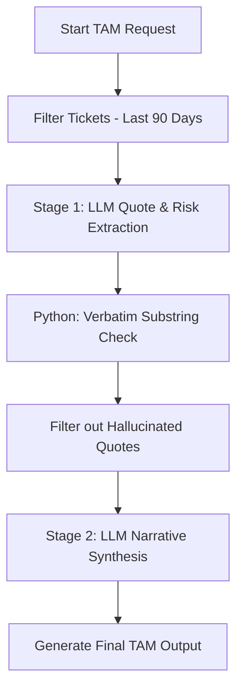

# Design Note: Automated Technical Support Triage & TAM Account Synthesis

This document outlines the architectural decisions, design tradeoffs, failure modes, data sensitivity precautions, and horizontal scaling strategies for the Intelligent Support Triage and TAM Account Summarizer platform.

---

## 1. Hybrid Retrieval Architecture

Although a lexical search algorithm like BM25 is highly effective for exact keyword matches (e.g., specific error codes like `ERR_CONNECTION_TIMEOUT` or product names like `SecureVault`), support tickets frequently describe issues using natural language and synonyms that do not exactly match the terminology of product documentation. 

To resolve this, the system deploys a hybrid search engine combining **BM25Okapi** and a dense vector index using a lightweight, CPU-efficient sentence embedding model (`all-MiniLM-L6-v2`) in ONNX format. 

### Why this hybrid architecture was selected:
- **Lexical Precision (BM25):** Ensures error codes, configuration keys, and exact product feature paths are mapped correctly.
- **Semantic Generalization (Dense Embeddings):** Captures user intent when support tickets contain vague language, synonyms, or conceptual descriptions of onboarding/usage issues.
- **Reciprocal Rank Fusion (RRF):** Fuses the lexical and semantic rankings mathematically (using $k=60$) to construct a single robust ranking, outperforming either search method individually.
- **Performance Tradeoff:** The lightweight `all-MiniLM-L6-v2` model offers a tiny CPU footprint and fast inference times (sub-10ms), running offline without dependency on external hosted APIs.

---

## 2. Failure Modes & Resilience Strategies

Any production-grade AI system relying on LLMs must incorporate mitigation strategies for common failure modes:

| Failure Mode | Description | Architectural Mitigation |
| :--- | :--- | :--- |
| **Prompt Injection** | Support tickets containing malicious prompts designed to bypass classification rules or hijack LLM instructions (e.g., instructing the model to mark the ticket as P1 and route it to Incident Response). | Strict boundary containment using JSON-only schema outputs (`response_format` and strict Pydantic parsing). The prompt separates the untrusted user input using clear markup tags. Structural verification ensures that even if an LLM is hijacked, it cannot output arbitrary text; it must output a schema matching the validated model. |
| **Schema Drift** | API upgrades or model adjustments that alter the generated JSON output structure, breaking client applications. | Enforcing schema parsing using strict Pydantic model validation on the LLM client output. The system fails fast and restarts/logs when schema parsing fails. Standardized schemas like `TriageOutput` and `TAMOutput` are versioned, and custom JSON parsers cleanly extract payloads even if the LLM wraps them in markdown blocks. |
| **Unverified Quote Failures** | In the TAM summarization stage, the LLM extracts an issue but synthesizes a fake quote (hallucination) to back it up. | A deterministic two-stage pipeline with Python-level substring validation. Any quote extracted in Stage 1 must be found verbatim (`quote in ticket_body`) in the raw ticket logs. If the quote fails this check, it is stripped. Only 100% verified quotes are passed to Stage 2 for final synthesis. |

---

## 3. Latency vs. Quality Tradeoffs

For the Technical Account Management (TAM) brief generator, there is a direct tradeoff between response latency and output quality:

To guarantee zero-hallucination briefs, the system runs a two-stage sequential prompt chain. 
- **Stage 1 (Extraction):** Identifies support tickets containing risks and pulls exact verbatim quotes.
- **Verification:** Runs programmatic checks on the server to discard fake quotes.
- **Stage 2 (Synthesis):** Combines the verified quotes and metadata to write the executive brief.

This architecture requires two separate LLM API calls, which roughly doubles the latency compared to a single-stage call. However, this is a necessary tradeoff. A single-stage prompt asking the LLM to summarize and cite quotes concurrently is highly prone to hallucinating citations or misattributing text. For a TAM brief where business decisions are made based on customer sentiment and renewal risks, correctness and verification are prioritized over sub-second latency. For interactive use cases, token-level streaming via Server-Sent Events (SSE) is implemented in Stage 2 to minimize perceived latency for end users.

---

## 4. Data Sensitivity & PII Sanitization

Protecting customer data is a core compliance requirement. Support tickets often contain Personally Identifiable Information (PII) such as email addresses, phone numbers, and network IP addresses. 

To ensure no PII is transmitted to external LLM provider APIs:
- All incoming ticket texts pass through a regex-based sanitization pipeline (`pii_sanitizer.py`) before entering the retrieval index or being sent to the LLM.
- **Email Redaction:** Matches standard email patterns and replaces them with `[EMAIL]`.
- **IP Address Redaction:** Redacts both IPv4 and IPv6 addresses, replacing them with `[IP]`.
- **Phone Number Redaction:** Matches international and local phone formats, replacing them with `[PHONE]`.
- Because the sanitization runs in-memory on our servers before the LLM call, it ensures compliance with data protection regulations (GDPR, CCPA) without degrading classification performance.

---

## 5. Engineering Roadmap for 10x Scaling

To scale this prototype to handle a 10x increase in volume (e.g., hundreds of thousands of tickets and accounts), the system must transition from in-memory processing to a decoupled, distributed architecture:

1. **Storage & Database Layer:**
   - Transition from flat JSON files (`tickets.json` and `accounts.json`) to a relational database (e.g., PostgreSQL).
   - Migrate from the in-memory BM25/sentence-transformers search to a dedicated vector database (such as pgvector, Pinecone, or Milvus) to scale document indexing and hybrid retrieval.

2. **Decoupled Job Queue (Async Processing):**
   - Generating a TAM brief requires multiple heavy operations. Synchronous REST calls will timeout at high scale.
   - Implement a message broker (RabbitMQ or Redis) and distributed task workers (Celery) to run the TAM generation asynchronously.
   - The API will immediately return a `task_id` (HTTP 202 Accepted) and users will poll or subscribe to a WebSocket/SSE endpoint to receive the generated brief when ready.

3. **Caching Strategy:**
   - Implement an active caching layer (Redis) for account briefs. Since the account history is deterministic based on the 90-day window, briefs can be cached until a new support ticket is filed for that account.

